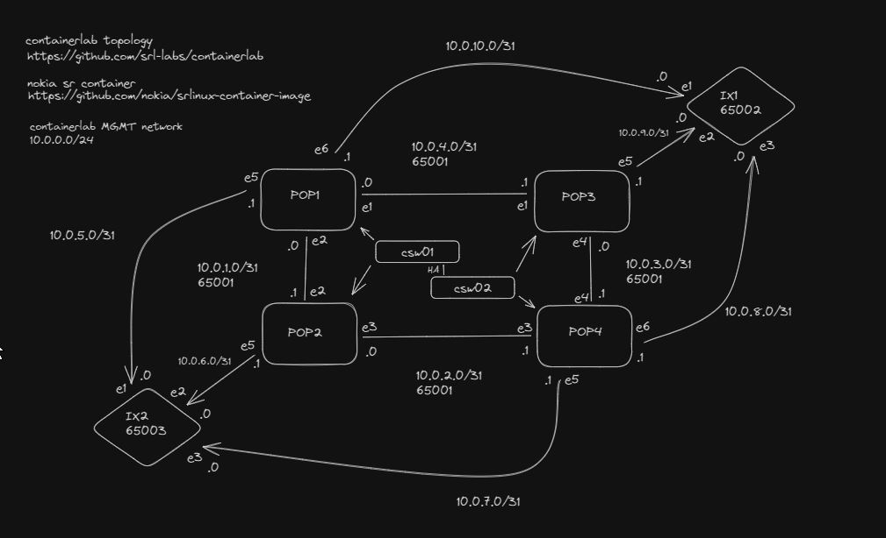
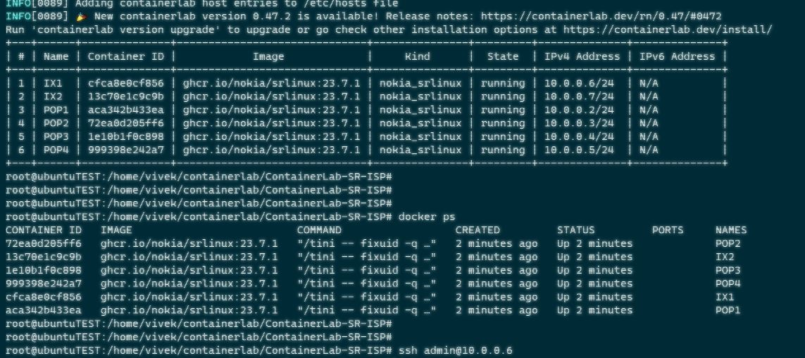
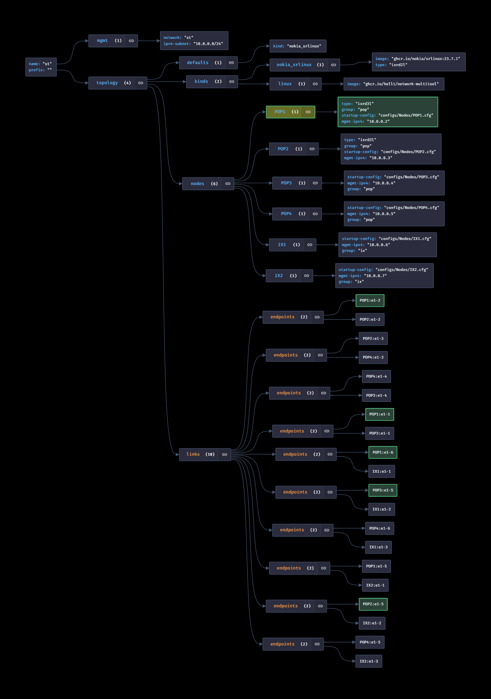

## prereqs 
docker daemon / containerlab / git clone or wget

## change into the cloned directory and execute
containerlab deploy --reconfigure

## to destroy
containerlab destroy --cleanup

ssh admin@managementIP \
default password - NokiaSrl1!

